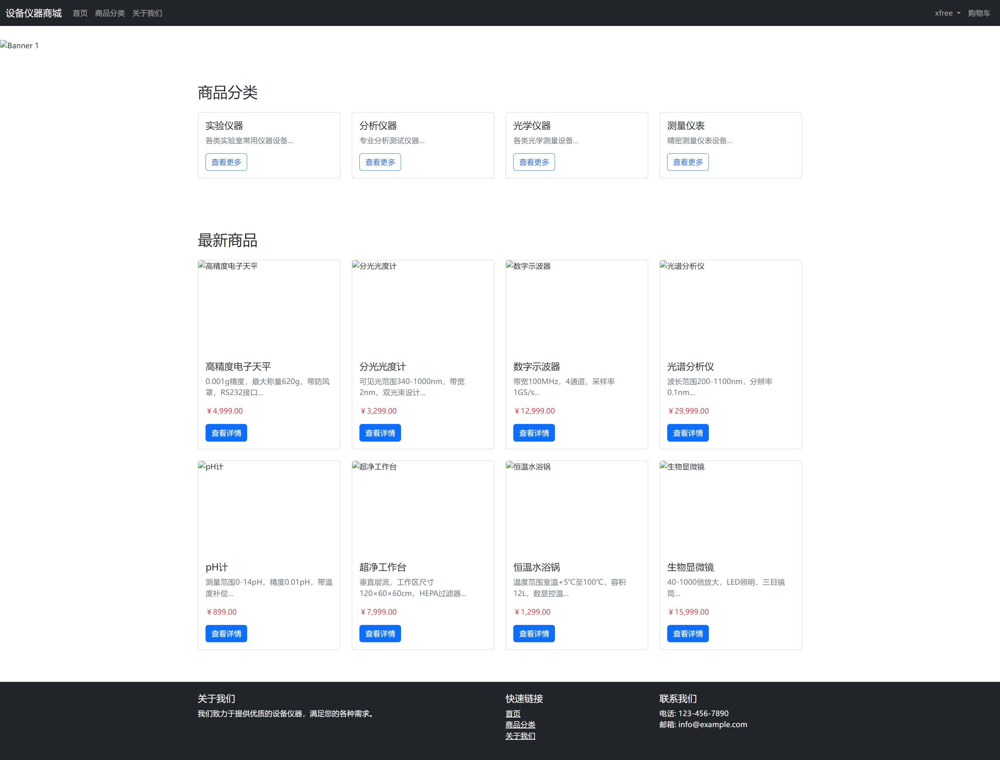
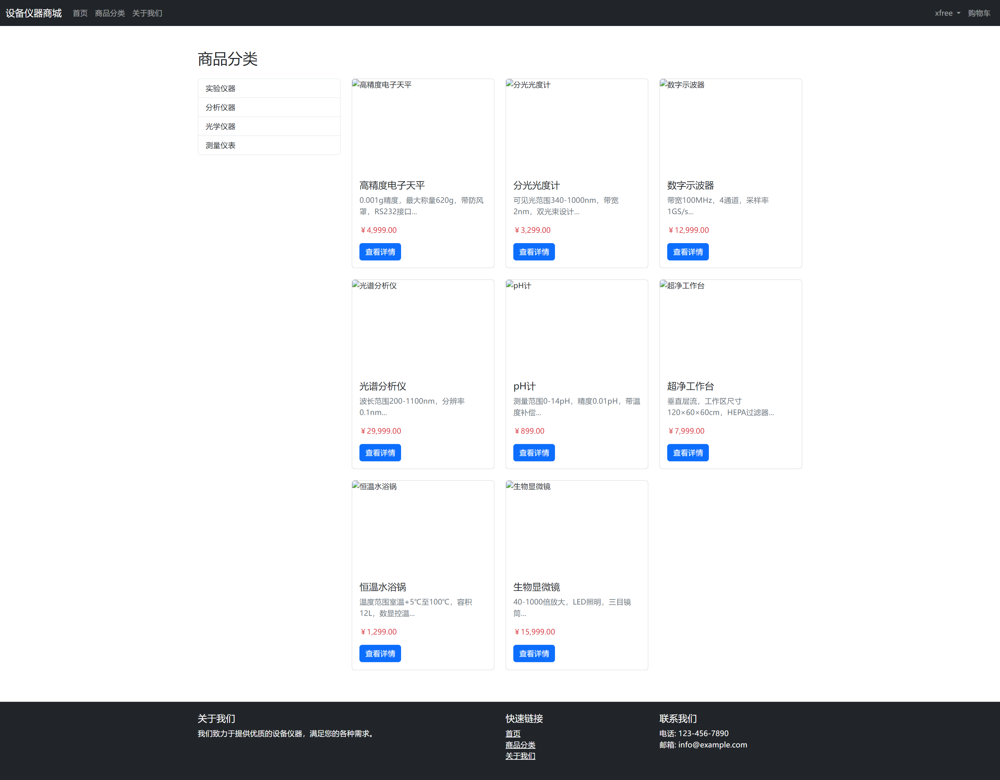
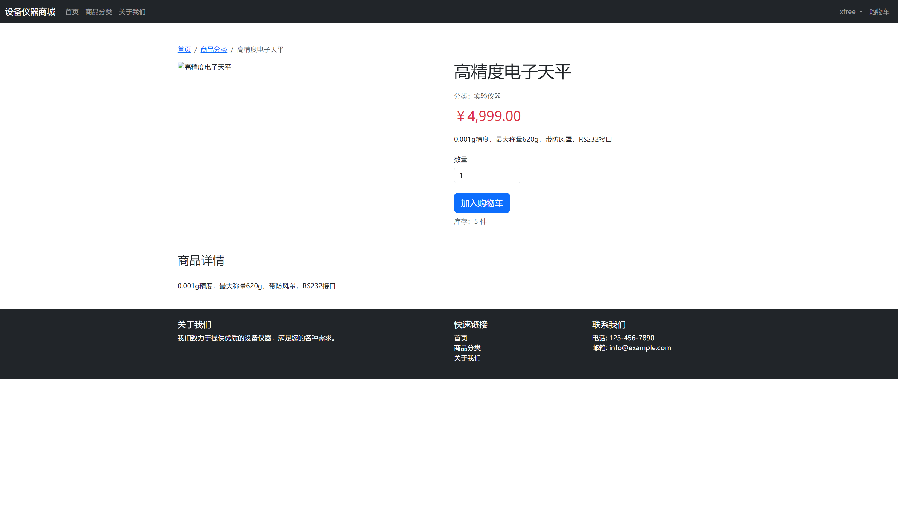
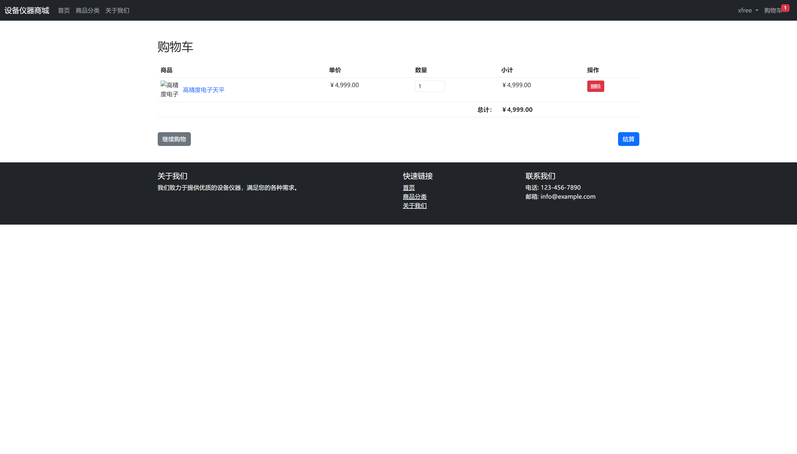
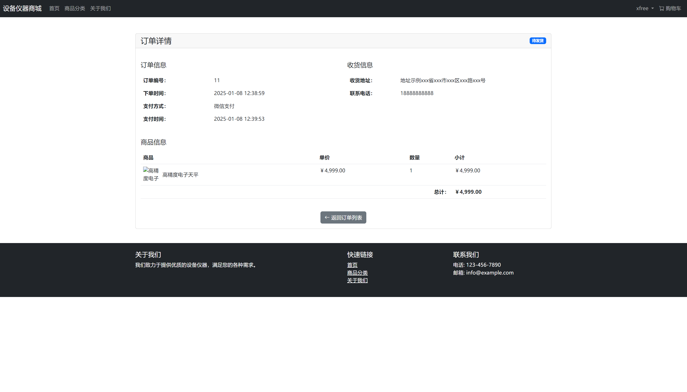
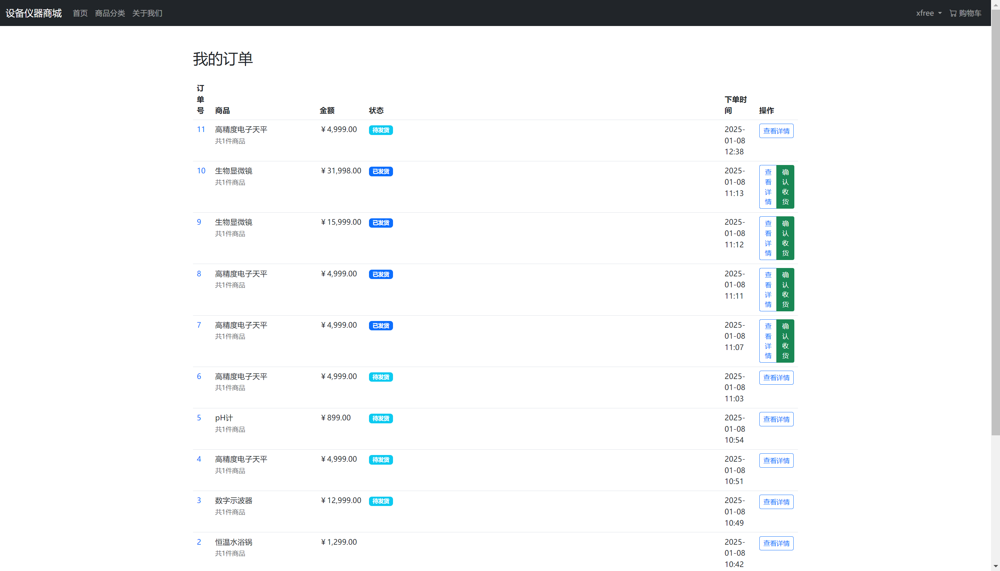
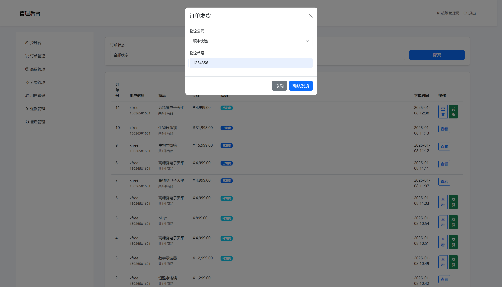
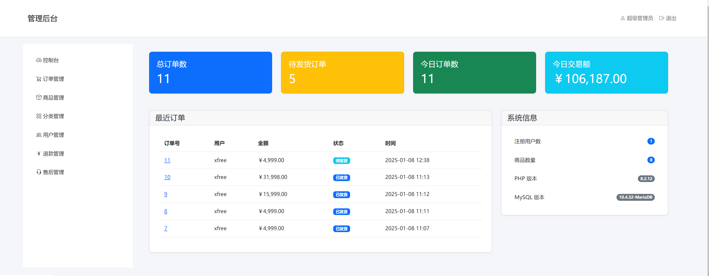

# 设备仪器商城

这是一个基于PHP开发的电子商城系统，主要功能包括：

- 商品分类展示
- 商品详情页
- 购物车功能
- 订单管理
- 用户中心
- 后台管理系统

## 技术栈

- 前端：Bootstrap 5 + jQuery
- 后端：PHP 7.4+
- 数据库：MySQL 5.7+
- 服务器：Apache/Nginx
- 缓存：无
- 其他：PDO数据库连接

## 核心功能实现

### 数据库层
- 使用PDO连接MySQL数据库
- 单例模式封装数据库操作
- 支持事务处理
- 使用预处理语句防止SQL注入

### 前端实现
- 响应式布局
- 商品分类展示
- 商品详情页
- 购物车功能
- 订单流程

### 后台管理
- 实时数据统计
- 订单管理
- 商品管理
- 用户管理
- 权限控制

## 主要模块

### 数据库配置
```php
// config/db.php
return [
    'host' => 'localhost',
    'dbname' => 'equipment_mall',
    'username' => 'root',
    'password' => 'WuChanJieJilianheqilai!',
    'charset' => 'utf8mb4',
    'options' => [
        PDO::ATTR_ERRMODE => PDO::ERRMODE_EXCEPTION,
        PDO::ATTR_DEFAULT_FETCH_MODE => PDO::FETCH_ASSOC,
        PDO::ATTR_EMULATE_PREPARES => false,
        PDO::MYSQL_ATTR_INIT_COMMAND => "SET NAMES utf8mb4"
    ]
];
```

### 数据库操作
```php
// core/Database.php
class Database {
    // 单例模式实现
    // 提供CRUD操作
    // 支持事务处理
}
```

## 安装运行

1. 环境要求：
   - PHP 7.4+
   - MySQL 5.7+
   - Composer

2. 安装步骤：
```bash
# 克隆项目
git clone https://github.com/example/equipment-mall.git

# 安装依赖
composer install

# 导入数据库
mysql -u root -p equipment_mall < sql/init.sql

# 配置数据库
vim config/db.php

# 启动开发服务器
php -S localhost:8000 -t public
```

## 截图预览

以下是系统主要页面的截图，按时间顺序排列：

  
*首页 - 2025-01-08 12:32:09*

  
*商品分类页 - 2025-01-08 12:38:53*

  
*商品详情页 - 2025-01-08 12:39:18*

  
*购物车页面 - 2025-01-08 12:39:28*

  
*订单确认页 - 2025-01-08 12:40:02*

  
*支付页面 - 2025-01-08 12:40:18*

  
*后台管理首页 - 2025-01-08 12:41:17*

  
*后台订单管理 - 2025-01-08 12:41:45*

## 关注我们

抖音ID：1036110286  
账号名：星樞引路

## 许可说明

本程序仅供学习研究使用，请勿用于商业用途。
